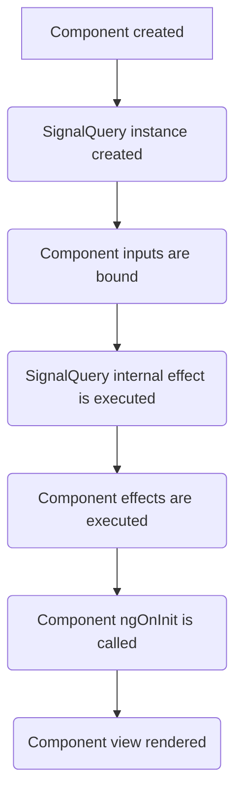

import Link from '@docusaurus/Link'
import BooksQuery from './_books-query.mdx';
import SignalQueryMethods from '@site/src/components/api-tables/SignalQueryMethods.md';
import SignalQuerySignals from '@site/src/components/api-tables/SignalQuerySignals.md';
import SignalQueryOptions from '@site/src/components/api-tables/SignalQueryOptions.md';

Create a reactive signal-based wrapper around a GraphQL query.

## API
```typescript
Apollo.signal.query<TData, TVariables>(
  options: SignalQueryOptions<TVariables, TData>
): SignalQuery<TData, TVariables>
```

Returns a `SignalQuery<TData, TVariables>` instance. This object provides several reactive Signals and methods for interaction.

<details>
  <summary>Options</summary>
  <SignalQueryOptions />
</details>

<details>
  <summary>Signals</summary>
  <SignalQuerySignals />
</details>

<details>
  <summary>Methods</summary>
  <SignalQueryMethods />
</details>

## Executing a query
To execute a query within an Angular component using Signals, inject `Apollo` and call `signal.query` with a GraphQL query document. The returned `SignalQuery` object's signals can be used directly in your component's template or logic to reactively render the UI based on the query's state (`loading`, `error`, `data`).

<BooksQuery />

Next, define the query in your component using `signal.query`:

```typescript title="books/books.component.ts"
import { Apollo } from '@apollo-orbit/angular';
import { BOOKS_QUERY } from '../graphql/types';

@Component({
  selector: 'app-books',
  templateUrl: './books.component.html'
})
export class BooksComponent {
  private readonly apollo = inject(Apollo);

  protected readonly booksQuery = this.apollo.signal.query({ query: BOOKS_QUERY });
}
```

Then, use the signals directly in the template to handle the different query states. Note the absence of the `async` pipe:

```html title="library/books/books.component.html"
<h3>Books</h3>
@if (booksQuery.loading()) { Loading... }
@if (booksQuery.error(); as error) { {{ error.message }} }
@for (book of booksQuery.data()?.books; track book.id) {
  <div>{{ book.displayName }}</div>
}
```

## Variables
A variables function or signal may be passed to `signal.query` options.  
If the function depends on reactive variables (e.g., based on component inputs or other signals), `SignalQuery` will automatically update the underlying query variables when these reactive variables change.

```typescript title="library/books/books.component.ts"
import { Apollo } from '@apollo-orbit/angular';
import { BOOKS_QUERY } from '../graphql/types';

@Component({
  selector: 'app-books',
  templateUrl: './books.component.html'
})
export class BooksComponent {
  private readonly apollo = inject(Apollo);
  
  // Component input signal
  public readonly authorId = input<string | undefined>();
  
  // Component-defined signal
  private readonly genre = signal<string | undefined>('Fiction');

  protected readonly booksQuery = this.apollo.signal.query({
    query: BOOKS_QUERY,
    variables: () => ({
      genre: this.genre(),
      authorId: this.authorId()
    })
  });

  // Derived reactive signal for the number of books
  protected readonly booksCount = computed(() => this.booksQuery.data()?.books.length);

  protected setGenre(newGenre?: string): void {
    this.genre.set(newGenre);
  }
}
```

This setup ensures that `SignalQuery` automatically reacts to changes in `genre` or the `authorId` input signal, refetching data as needed.

### Variables = `null`

When the variables function returns `null`, `SignalQuery` will automatically terminate execution:

```typescript title="library/book/book.component.ts"
import { Apollo } from '@apollo-orbit/angular';
import { BOOK_QUERY } from '../graphql/types';

@Component({
  selector: 'app-book',
  templateUrl: './book.component.html'
})
export class BookDetailsComponent {
  private readonly apollo = inject(Apollo);
  
  // Component input that might be null initially
  public readonly bookId = input<string | null>();

  protected readonly bookQuery = this.apollo.signal.query({
    query: BOOK_QUERY,
    variables: () => {
      const id = this.bookId();
      return id ? { id } : null; // Return null if bookId is not available
    }
  });
}
```

**Behavior when variables return `null`:**
- If the query hasn't executed yet, it won't execute until variables become non-null
- If the query is already active, it will terminate (disconnect from the observable and stop watching cache updates)
- When variables change from `null` to a non-null value, if the query is `enabled` then it will automatically execute

This pattern is useful for:
- Waiting for required input parameters before executing a query
- Conditionally executing queries based on user selections
- Preventing unnecessary queries when dependencies are not ready

## Lazy Queries
In some cases, you may want to delay the execution of a query until a specific event occurs (e.g., a button click). This can be achieved by using the `lazy` option in `signal.query`:

```typescript title="library/books/books.component.ts"
import { Apollo } from '@apollo-orbit/angular';
import { BOOKS_QUERY } from '../graphql/types';

@Component({
  selector: 'app-books',
  templateUrl: './books.component.html'
})
export class BooksComponent {
  private readonly apollo = inject(Apollo);
  ...
  protected readonly lazyBooksQuery = this.apollo.signal.query({
    query: BOOKS_QUERY,
    lazy: true, // Delay execution until explicitly called
    variables: () => ({
      genre: this.genre(),
      authorId: this.authorId()
    })
  });

  protected async onBooksSectionExpanded(): Promise<void> {
    // Execute the query. It will use the latest value from the variables function.
    // This can be safely called multiple times even if the query is already active.
    const { error, data } = await this.lazyBooksQuery.execute();

    if (error) {
      // Optionally handle error
    } else if (data) {
      // Optionally handle data
    }
  }

  protected onBooksSectionCollapsed(): void {
    // Terminate the query and stop listening to variables changes or cache updates.
    this.lazyBooksQuery.terminate();
  }
}
```

Alternatively, you can pass a `variables` object to `execute({ variables: { genre: 'Fiction' } })` to override the values provided in the `signal.query` options for that specific execution. Keep in mind that any future changes in the `variables` function (if provided in the initial options) will still automatically update the query variables after the initial execution.

Setting `lazy: true` makes the query variables optional (even if required by the query), allowing you to pass them only when executing the query via the `execute` method.

:::info
The promises returned by `execute`, `refetch` and `subscribeToMore` **always** resolve without a rejection even if the query encounters errors, removing the need for `try...catch` or dealing with unhandled promise rejections.
:::

## Component Lifecycle

Understanding how `SignalQuery` fits into the Angular component lifecycle is crucial for effective usage.

Similar to Angular's <Link to="https://angular.dev/guide/signals/resource">`resource`/`rxResource`</Link>, `SignalQuery` utilises an `effect` internally to establish a subscription to the underlying `watchQuery` observable.

The timing of this effect is important. In Angular v19+, component `effect`s are executed as part of the component's change detection lifecycle, after the component input bindings have been set and before component `ngOnInit` lifecycle hook.

Consequently, the earliest safe place to call `SignalQuery` instance methods like `refetch`, `fetchMore`, or `subscribeToMore`, is within a separate component `effect` defined in the constructor. This ensures your effect runs after the internal setup has occurred. Attempting to call these methods directly in the constructor or in `ngOnInit`, before the underlying query observable has been instantiated, will throw a `SignalQueryExecutionError`.

Similarly, calling these methods on a `lazy` `SignalQuery` instance before calling `execute()` will also throw `SignalQueryExecutionError`.

The following diagram shows where `SignalQuery` typically fits within the Angular component lifecycle:



### Example: `subscribeToMore`

Let's enhance the `BooksComponent` to subscribe to real-time updates when a new book is added.

```typescript title="library/books.component.ts"
import { Apollo } from '@apollo-orbit/angular';
import { BOOKS_QUERY, NEW_BOOK_SUBSCRIPTION } from '../graphql/types';

@Component({
  selector: 'app-books',
  templateUrl: './books.component.html'
})
export class BooksComponent {
  private readonly apollo = inject(Apollo);

  protected readonly booksQuery = this.apollo.signal.query({ query: BOOKS_QUERY });

  public constructor() {
    effect(onCleanup => onCleanup(this.booksQuery.subscribeToMore({
      subscription: NEW_BOOK_SUBSCRIPTION,
      updateQuery: (prev, { subscriptionData }) => ({
        ...prev,
        books: [...prev.books, subscriptionData.data.newBook]
      })
    })));
  }
}
```
