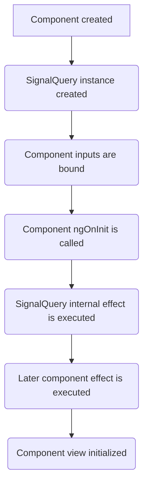

import Link from '@docusaurus/Link'
import BooksQuery from './_books-query.mdx';
import SignalQueryMethods from '@site/src/components/api-tables/SignalQueryMethods.md';
import SignalQuerySignals from '@site/src/components/api-tables/SignalQuerySignals.md';
import SignalQueryOptions from '@site/src/components/api-tables/SignalQueryOptions.md';

Create a reactive signal-based wrapper around a GraphQL query.

For a query that fetches once per execution instead of watching the cache, see <Link to="../signal.query.once/">`signal.query.once`</Link>.

## API
```typescript
Apollo.signal.query<TData, TVariables, TErrorPolicy, TPartial>(
  options: SignalQueryOptions<TData, TVariables, TErrorPolicy, TPartial>
): SignalQuery<TData, TVariables, WatchQueryStates<TPartial>, TErrorPolicy>
```

Returns a `SignalQuery<TData, TVariables>` instance. This object provides several reactive Signals and methods for interaction.

<details>
  <summary>Options</summary>
  <SignalQueryOptions />
</details>

<details>
  <summary>Signals</summary>
  <SignalQuerySignals />
</details>

<details>
  <summary>Methods</summary>
  <SignalQueryMethods />
</details>

## Executing a query
To execute a query within an Angular component using Signals, inject `Apollo` and call `signal.query` with a GraphQL query document. The returned `SignalQuery` object's signals can be used directly in your component's template or logic to reactively render the UI based on the query's state (`loading`, `error`, `data`).

<BooksQuery />

Next, define the query in your component using `signal.query`:

```typescript title="books/books.component.ts"
import { Apollo } from '@apollo-orbit/angular';
import { BOOKS_QUERY } from '../graphql';

@Component({
  selector: 'app-books',
  templateUrl: './books.component.html'
})
export class BooksComponent {
  private readonly apollo = inject(Apollo);

  protected readonly booksQuery = this.apollo.signal.query({ query: BOOKS_QUERY });
}
```

Then, use the signals directly in the template to handle the different query states. Note the absence of the `async` pipe:

```html title="library/books/books.component.html"
<h3>Books</h3>
@if (booksQuery.loading()) { Loading... }
@if (booksQuery.error(); as error) { {{ error.message }} }
@for (book of booksQuery.data()?.books; track book.id) {
  <div>{{ book.displayName }}</div>
}
```

## Variables
Variables are given as a function or signal, never as a plain object. Whenever its reactive dependencies change (component inputs, other signals), `SignalQuery` updates the underlying query variables to match.

A plain object is rejected on purpose. It would read each signal among its values once, when the query is created, and the query would then never see those signals change again, which compiles cleanly and fails silently. Write `variables: () => ({ id: this.id() })` rather than `variables: { id: this.id() }`, and use the function form even for variables that never change.

```typescript title="library/books/books.component.ts"
import { Apollo } from '@apollo-orbit/angular';
import { BOOKS_QUERY } from '../graphql';

@Component({
  selector: 'app-books',
  templateUrl: './books.component.html'
})
export class BooksComponent {
  private readonly apollo = inject(Apollo);
  
  // Component input signal
  public readonly authorId = input<string | undefined>();
  
  // Component-defined signal
  private readonly genre = signal<string | undefined>('Fiction');

  protected readonly booksQuery = this.apollo.signal.query({
    query: BOOKS_QUERY,
    variables: () => ({
      genre: this.genre(),
      authorId: this.authorId()
    })
  });

  // Derived reactive signal for the number of books
  protected readonly booksCount = computed(() => this.booksQuery.data()?.books.length);

  protected setGenre(newGenre?: string): void {
    this.genre.set(newGenre);
  }
}
```

This setup ensures that `SignalQuery` automatically reacts to changes in `genre` or the `authorId` input signal, refetching data as needed.

### Variables = `null`

When the variables function returns `null`, `SignalQuery` pauses execution and clears `loading()`, including before the first effect runs. Returning non-null variables resumes the query while `enabled()` is true:

```typescript title="library/book/book.component.ts"
import { Apollo } from '@apollo-orbit/angular';
import { BOOK_QUERY } from '../graphql';

@Component({
  selector: 'app-book',
  templateUrl: './book.component.html'
})
export class BookDetailsComponent {
  private readonly apollo = inject(Apollo);
  
  // Component input that might be null initially
  public readonly bookId = input<string | null>();

  protected readonly bookQuery = this.apollo.signal.query({
    query: BOOK_QUERY,
    variables: () => {
      const id = this.bookId();
      return id ? { id } : null; // Return null if bookId is not available
    }
  });
}
```

**Behavior when variables return `null`:**
- If the query hasn't executed yet, it won't execute until variables become non-null
- If the query is already active, it will terminate (disconnect from the observable and stop watching cache updates)
- When variables change from `null` to a non-null value, if the query is `enabled` then it will automatically execute

This pattern is useful for:
- Waiting for required input parameters before executing a query
- Conditionally executing queries based on user selections
- Preventing unnecessary queries when dependencies are not ready

## Reactive options

`variables` is not the only option that can be given as a function. Every option in the table above whose type ends in `| (() => ...)` accepts either a value or a function, which is what a query whose document or context arrives through `input.required` needs. A signal is itself a function, so it can be passed directly.

Every other option is read once, either because it cannot change after the query is created, because its own value is a function and the two could not be told apart, or because the result type is inferred from it, as it is for `errorPolicy` and `returnPartialData`.

```typescript title="library/books/books.component.ts"
@Component({
  selector: 'app-books',
  templateUrl: './books.component.html'
})
export class BooksComponent {
  private readonly apollo = inject(Apollo);

  public readonly query = input.required<TypedDocumentNode<BooksQueryData, BooksQueryVariables>>();
  public readonly authorId = input<string | undefined>();
  public readonly tenant = input.required<string>();

  protected readonly booksQuery = this.apollo.signal.query({
    query: this.query,
    variables: () => ({ authorId: this.authorId() }),
    context: () => ({ headers: { 'x-tenant': this.tenant() } })
  });
}
```

What each change does follows Apollo Client's own rules:

| Changed | Effect |
| --- | --- |
| `query` | The query is re-executed against the new document, in one request. |
| `variables` | The existing variables behaviour: a new request, or termination on `null`. |
| `fetchPolicy` to or from `standby` | The query is parked, or restarted. |
| `context`, `pollInterval`, `notifyOnNetworkStatusChange`, and the rest | Merged into the running query with no request. `pollInterval` restarts or stops polling. |

:::info
A `context` change alone does not fetch. The next request the query makes carries it, so a query that must reload when a header changes calls `refetch()` itself.
:::

A function has to return a value. Apollo merges the options it is given and ignores `undefined`, so returning a `context` and then dropping it would leave the previous one in place rather than clear it. Polling stops when `pollInterval` returns `0`, and the query itself is stopped by returning `null` from `variables`.

The options are also the source of truth for what the query is running. A reactive change re-asserts all of them, so anything set imperatively since the last one is overwritten: `startPolling()` and `stopPolling()` give way to `pollInterval`, and the `context` passed to a single `execute({ context })` gives way to the `context` option. `useQuery` behaves the same way.

## Lazy Queries
In some cases, you may want to delay the execution of a query until a specific event occurs (e.g., a button click). This can be achieved by using the `lazy` option in `signal.query`:

```typescript title="library/books/books.component.ts"
import { Apollo } from '@apollo-orbit/angular';
import { BOOKS_QUERY } from '../graphql';

@Component({
  selector: 'app-books',
  templateUrl: './books.component.html'
})
export class BooksComponent {
  private readonly apollo = inject(Apollo);
  ...
  protected readonly lazyBooksQuery = this.apollo.signal.query({
    query: BOOKS_QUERY,
    lazy: true, // Delay execution until explicitly called
    variables: () => ({
      genre: this.genre(),
      authorId: this.authorId()
    })
  });

  protected async onBooksSectionExpanded(): Promise<void> {
    // Execute the query. It will use the latest value from the variables function.
    // This can be safely called multiple times even if the query is already active.
    const { error, data } = await this.lazyBooksQuery.execute();

    if (error) {
      // Optionally handle error
    } else if (data) {
      // Optionally handle data
    }
  }

  protected onBooksSectionCollapsed(): void {
    // Terminate the query and stop listening to variables changes or cache updates.
    this.lazyBooksQuery.terminate();
  }
}
```

Alternatively, you can pass a `variables` object to `execute({ variables: { genre: 'Fiction' } })` to override the values provided in the `signal.query` options for that specific execution. Keep in mind that any future changes in the `variables` function (if provided in the initial options) will still automatically update the query variables after the initial execution.

`refetch({ genre: 'Fiction' })` behaves the same way. The variables you pass are merged into the current ones and written back into the `variables` signal, so `variables()` always reflects the query that is actually running. As with `execute`, a later emission of the `variables` function overrides them.

Setting `lazy: true` makes the query variables optional (even if required by the query), allowing you to pass them only when executing the query via the `execute` method.

:::info
The promise follows the operation's `errorPolicy`: it **rejects** under `none` (the default), and resolves under `all` and `ignore`. Under `none`, a fulfilled promise has non-optional `data`. Failures are also available through the operation's `error()` signal.

Ignoring the promise is safe when the template reads the result signals. `fetchMore` is different: a failure leaves the existing result intact, so handle its promise to display a page-loading error. Chaining `.then`, `.catch` or `.finally` creates a new promise that needs its own rejection handling.
:::

## Result types and Apollo options

Narrow `result()` on `dataState` to access the corresponding data shape. `returnPartialData: true` permits incomplete cache data; `false` excludes the `partial` branch. See Apollo's [data-state narrowing guide](https://www.apollographql.com/docs/react/data/typescript#type-narrowing-data-with-datastate) and Orbit's [incremental delivery notes](../../../advanced/apollo-client-4.3/#incremental-delivery).

Set `errorPolicy` and `returnPartialData` at creation because they determine the result type. [Declared defaults](../../../advanced/default-options/) apply when `errorPolicy` is omitted.

For automatic refetching on focus, reconnect, or custom events, configure Apollo's [event-based refetching](https://www.apollographql.com/docs/react/data/event-based-refetching) through `withApolloOptions` and use `refetchOn` on the query.

## Component Lifecycle

An internal effect starts the watched query once inputs are available. `refetch`, `fetchMore` and `subscribeToMore` throw `SignalQueryExecutionError` while `active()` is false. Start lazy queries with `execute()`.

Check `active()` before subscribing. Pausing with `null` variables or calling `terminate()` removes `subscribeToMore` registrations; register them again on resume. Destroying the injection context cleans up the query.

Cancelled execution promises still follow `errorPolicy`: `none` rejects; `all` resolves with an error; `ignore` resolves without one. Signal queries also [hold Angular application stability](../../../advanced/ssr/) while their tracked requests are pending.

For a non-lazy query created in a component field, with non-null variables and another component effect registered afterward, the initial lifecycle in Angular 22 follows this order:


```mermaid
graph TD
  A[Component created] --> B(SignalQuery instance created);
  B --> C(Component inputs are bound);
  C --> D(Component ngOnInit is called);
  D --> E(SignalQuery internal effect is executed);
  E --> F(Later component effect is executed);
  F --> G(Component view initialized);
```

`ngOnInit` can read inputs, but automatic query execution happens afterward. The later component effect can use the active query. Root-injector effects follow [different scheduling](https://angular.dev/guide/signals/effect#execution-of-effects).

### Example: `subscribeToMore`

Let's enhance the `BooksComponent` to subscribe to real-time updates when a new book is added.

```typescript title="library/books.component.ts"
import { Apollo } from '@apollo-orbit/angular';
import { BOOKS_QUERY, NEW_BOOK_SUBSCRIPTION } from '../graphql';

@Component({
  selector: 'app-books',
  templateUrl: './books.component.html'
})
export class BooksComponent {
  private readonly apollo = inject(Apollo);

  protected readonly booksQuery = this.apollo.signal.query({ query: BOOKS_QUERY });

  public constructor() {
    effect(onCleanup => {
      if (!this.booksQuery.active()) return;

      onCleanup(this.booksQuery.subscribeToMore({
        subscription: NEW_BOOK_SUBSCRIPTION,
        updateQuery: (prev, { subscriptionData }) => ({
          ...prev,
          books: [...prev.books, subscriptionData.data.newBook]
        })
      }));
    });
  }
}
```
